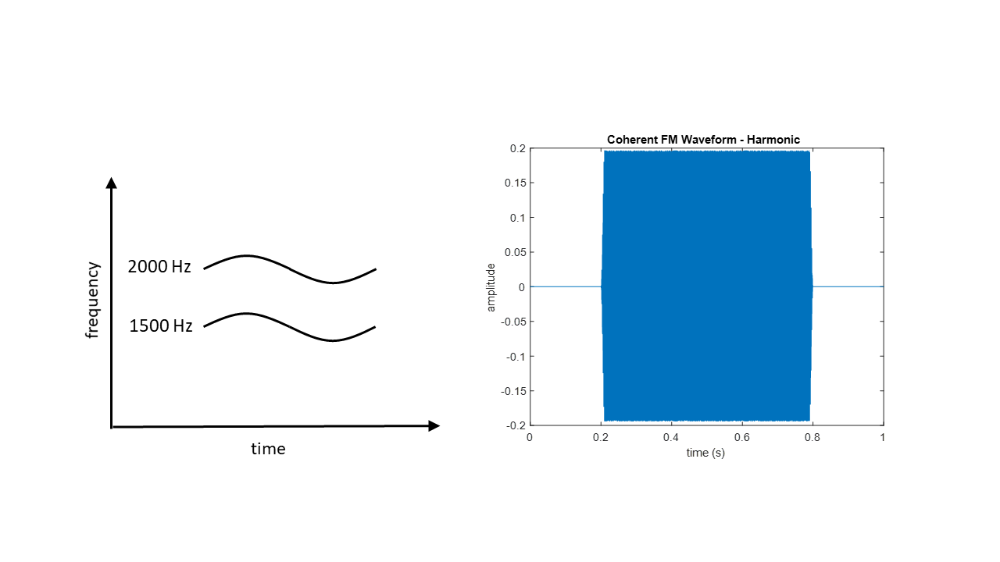
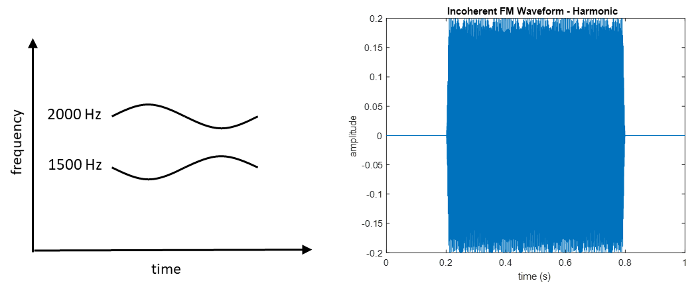
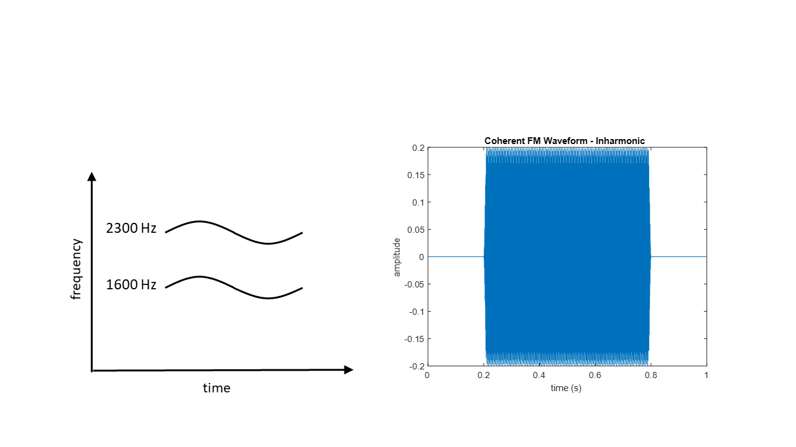

# Discriminating FM coherence and incoherence using a convolutional neural network (CNN)

## Introduction

In natural auditory environments, we are constantly exposed to multiple concurrent sound sources. Our auditory system can partition the acoustic featuers into meaningful custers and then group them together to form auditory events. This process is called auditory scene analysis (Bregman, 1990) and allows us to extract essential information effectively from a noisy environment. To do this effectively, we rely on some acoustic cues contributing to the fusion/segregation of multiple sounds, such as onset asynchrony, harmonicity, or spectral proximity. Another acoustic feature we commonly observe in the auditory scene is change in frequency, and one example is sinusoidal frequency modulation (SFM). When multiple sounds go through the same modulation pattern, they are called to be "coherent". Many natural sounds, such as voice or music, contain coherent oscillation in frequnencies of their components. One question can be raised: can frequency modulation (FM) coherence be a grouping cue?

Carlyon (1991) stated that it is first necessary to measure sensitivity to FM coherence to further study the use of incoherence in the perceptual separation of concurrent complex sounds. Accordingly, Carlyon conducted experiments on discrimination between incoherently and coherently modulated complex sounds, using harmonic and inharmonic stimuli. Harmonic stimuli consistsed of carrier frequencies of 1500 and 2000 Hz, while inharmonic stimuli had carrier frequencies of 1600 and 2300 Hz. 

<em> <strong>Figure 2.</strong> A time-by-frequency representation of a coherently frequency modulated harmonic sound and its waveform. </em>

This project seeks to replicate the work of Carlyon (1991) using a convolutional neural network. Two questions we investigate in this project are: (1) Can a neural network disriminate between coherent 

## Methods

<em> <strong>Figure 2.</strong> A time-by-frequency representation of a coherently frequency modulated harmonic sound and its waveform. </em>

<em> <strong>Figure 3.</strong> A time-by-frequency representation of a incoherently frequency modulated harmonic sound and its waveform. </em>

<em> <strong>Figure 4.</strong> A time-by-frequency representation of a coherently frequency modulated inharmonic sound and its waveform. </em>

<em> <strong>Figure 5.</strong> A time-by-frequency representation of a coherently frequency modulated inharmonic sound and its waveform. </em>

## Results

## Discussion

## References
Bregman, A. S. (1990). Auditory Scene Analysis: The Perceptual Organization of Sound. MIT Press.

Carlyon, R. P. (1991). Discriminating between coherent and incoherent frequency modulation of complex tones. The Journal of the Acoustical Society of America, 89, 329–340.

Choi, K., Fazekas, G., & Sandler, M. (2016). Explaining Deep Convolutional Neural Networks on Music Classification. ArXiv:1607.02444 [Cs]. Retrieved from http://arxiv.org/abs/1607.02444

Kayed, M., Anter, A., & Mohamed, H. (2020). Classification of Garments from Fashion MNIST Dataset Using CNN LeNet-5 Architecture. 2020 International Conference on Innovative Trends in Communication and Computer Engineering (ITCE), 238–243.

Palanisamy, K., Singhania, D., & Yao, A. (2020). Rethinking CNN Models for Audio Classification. ArXiv:2007.11154 [Cs, Eess]. Retrieved from http://arxiv.org/abs/2007.11154
