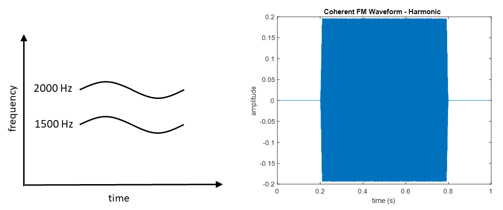
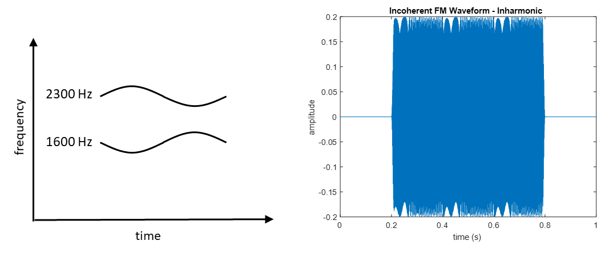

# Discriminating FM coherence and incoherence using the Convolutional Neural Network (CNN)

## Introduction

In natural auditory environments, we are constantly exposed to multiple concurrent sound sources. Our auditory system can partition the acoustic featuers into meaningful custers and then group them together to form auditory events. This process is called auditory scene analysis (Bregman, 1990) and allows us to extract essential information effectively from a noisy environment. To do this effectively, we rely on some acoustic cues contributing to the fusion/segregation of multiple sounds, such as onset asynchrony, harmonicity, or spectral proximity. Another acoustic feature we commonly observe in the auditory scene is change in frequency, and one example is sinusoidal frequency modulation (SFM). When multiple sounds go through the same modulation pattern, they are called to be "coherent". Many natural sounds, such as voice or music, contain coherent oscillation in frequnencies of their components. One question can be raised: can frequency modulation (FM) coherence be a grouping cue?

Carlyon (1991) stated that it is first necessary to measure sensitivity to FM coherence to further study the use of incoherence in the perceptual separation of concurrent complex sounds. Accordingly, Carlyon conducted experiments on discrimination between incoherently and coherently modulated complex sounds, using harmonic and inharmonic stimuli. Harmonic stimuli consisted of carrier frequencies of 1500 and 2000 Hz, while inharmonic stimuli had carrier frequencies of 1600 and 2300 Hz. The task was to judge whether the sound played was coherent (componenets were modulated in-phase) or incoherent (one component has a phase delay). As shown in Figure 1, listeners achieved near-perfect performance when a sound was harmonic, but no improvement was shown in discriminaton using inharmonic complexes. Carlyon reasoned that listeners were able to discriminate between coherent and incoherent FM because modulation incoherence caused one component in a harmonic complex to become mistuned. Performance was greately reduced when this "mistuning" cue was unavailable. He therefore argued that there exists no across-frequency mechanism specific to detection of FM coherence.

<em> <strong>Figure 1.</strong> Results of Carlyon (1991). Each panel represents one individual, showing d prime as a function of modulator phase delay for harmonic (every condition but 1600 + 2300 Hz) and inharmonic (1600 + 2300 Hz) stimuli. </em>

On the other hand, a very powerful algorithm known as the Convolutional Neural Network (CNN) is often used for classification task. Its capabilities for performing Machine Learning on images are well known and explored. For example, CNN-based architecture has shown very good results in many domains such as image classification, pattern recognition or image segmentation. Additionally, LeNet-5 model achieved accuracy over 98% using Fashion MNIST dataset (Kayed et al., 2020). Also, sounds can be turned into images in some manner (waveforms or spectrograms), so CNN is also used as a tool for audio classification. CNN based models have been used for a variety of tasks from music genre classification, music-noise segmentation or environment sound classification (Choi et al., 2016; Palanisamy et al., 2020). However, whether CNN can extract phase information from waveforms has not been studied. 

This project seeks to replicate the work of Carlyon (1991) using CNN. Two questions we investigate in this project are: (1) Can a neural network discriminate between coherent and incoherent FM? and (2) Is there a difference in prediction accuracy between harmonic and inharmonic stimuli just like human listeners did? 

## Methods

**Stimuli and Dataset Structure**

The dataset contained 550 samples of coherent and incoherent FM sound waveforms, 50 of which were used as testing set, and 500 were used as training set. Each signal was 600-ms long and was generated via MATLAB. Incoherent FM had a phase delay of pi between components. For each sample, coherent waveforms were labeled "0" and incoherent ones were labeled "1". Waveforms and labels were saved separately as "data" and "target", respectively. In accordance with the work of Carlyon (1991), harmonic stimuli consisted of carrier frequencies of 1500 and 2000 Hz, while inharmonic stimuli had carrier frequencies of 1600 and 2300 Hz. Figures 2-5 show what each stimulus type looks like.  

<em> <strong>Figure 2.</strong> A time-by-frequency representation of a coherently frequency modulated harmonic sound and its waveform. </em>

<em> <strong>Figure 3.</strong> A time-by-frequency representation of an incoherently frequency modulated harmonic sound and its waveform. </em>

<em> <strong>Figure 4.</strong> A time-by-frequency representation of a coherently frequency modulated inharmonic sound and its waveform. </em>

<em> <strong>Figure 5.</strong> A time-by-frequency representation of an incoherently frequency modulated inharmonic sound and its waveform. </em>

**Convolutional Networks**
The neural network used in this project is a convolutional neural network using Conv1D. The network consists of three layers, two convolutional and an output layers. 

## Results
Results are shown in Figure 6 and 7, representing the training and testing accuracies. Training accuracy remained at around 50% for both harmonic and inharmonic stimuli, and testing accuracy did not go over 56%. From the results, we cannot conclude that the network learned to discriminate between FM coherence and incoherence, no matter what the harmonic relation between components is. 

<em> <strong>Figure 6.</strong> Training and Testing accuracies for harmonic stimuli. </em>

<em> <strong>Figure 7.</strong> Training and Testing accuracies for inharmonic stimuli. </em>

## Discussion
This project was intended to apply the Convolutional Neural Network to the work by Carlyon (1991) on discrimination of FM coherence and incoherence. The psychophysical experiment showed that human listeners are sensitive to FM incoherence only with harmonic stimuli because "mistuning cue" is not available with inharmonic stimuli. The current project was expected to be a bridge between two fields: psychophysics and machine learning.

The data did not show successful result; training accuracy was slightly better with inharmonic stimuli but never reached close to 100%. Testing accuracy turned out to be greater than training accuracy and never went beyond 56%. Unsuccessful result was most likely due to some errors in the model. If not, one possibility is that difference in waveforms between coherent and incoherent FM was so subtle that the network could not detect that difference, although CNN is capable of classifying a wide range of audio signals by extracting more apparent features. It is still unclear whether the neural network can use the phase information to categorize two types of stimuli. 

Some future directions are: (1) Increasing the sample size, (2) Using RNN or a combination of both CNN and RNNs to improve the sequential understanding of the data, or (3) Adding more components to complexes so that difference in waveforms between coherent and incoherent FM could become more clear. 

## References
Bregman, A. S. (1990). Auditory Scene Analysis: The Perceptual Organization of Sound. MIT Press.

Carlyon, R. P. (1991). Discriminating between coherent and incoherent frequency modulation of complex tones. The Journal of the Acoustical Society of America, 89, 329–340.

Choi, K., Fazekas, G., & Sandler, M. (2016). Explaining Deep Convolutional Neural Networks on Music Classification. ArXiv:1607.02444 [Cs].

Kayed, M., Anter, A., & Mohamed, H. (2020). Classification of Garments from Fashion MNIST Dataset Using CNN LeNet-5 Architecture. 2020 International Conference on Innovative Trends in Communication and Computer Engineering (ITCE), 238–243.

Palanisamy, K., Singhania, D., & Yao, A. (2020). Rethinking CNN Models for Audio Classification. ArXiv:2007.11154 [Cs, Eess].
