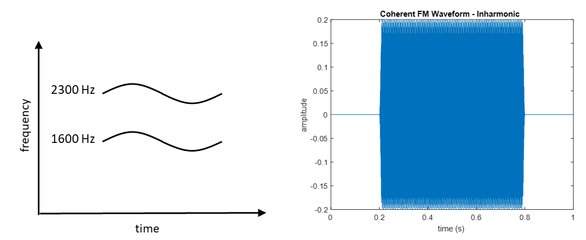

# Discriminating FM coherence and incoherence using a convolutional neural network (CNN)

## Introduction

In natural auditory environments, we are constantly exposed to multiple concurrent sound sources and our auditory system can partition the acoustic featuers into meaningful custers and them group them together to form auditory events. This process is called auditory scene analysis (Bregman, 1990) and allows us to extract essential information effectively from a noisy environment. 

This project seeks to replicate the work of Carlyon (1991) using a convolutional neural network. Two questions we investigate in this project are: (1) Can a neural network disriminate between coherent 

## Methods

<em> <strong>Figure 1.</strong> A time-by-frequency representation of a coherently frequency modulated sound and its waveform. </em>

<em> <strong>Figure 2.</strong> A time-by-frequency representation of a incoherently frequency modulated sound and its waveform. </em>

<em> <strong>Figure 1.</strong> A time-by-frequency representation of a coherently frequency modulated sound and its waveform. </em>

<em> <strong>Figure 1.</strong> A time-by-frequency representation of a coherently frequency modulated sound and its waveform. </em>

## Results

## Discussion

## References
